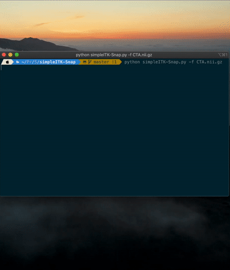

<div align="center">
  
</div>

## Overview

It's a Qt-based 3D medical image visualization tool. Unlike most visualization tool, SimpleITKSnap gives you more
freedom via extension design.
The code is short thus it's super easy to understand and modify. In short, it is an ITK-Snap in 200 lines!

If you have any bug when using simpleITK-Snap, please put that on the issue.
## Install
First, clone this repo to your local environment:

```bash
git clone https://github.com/JamesQFreeman/simpleITK-Snap.git
```

Then use pip to install the dependency package:

```bash
pip install -r requirements.txt
```

Then you are ready to go!

## Usage
Let's see an example of a brain CT image:
### Application Mode
To open an image, simply type:

```bash
python simpleITK-Snap -f YourFile.nii.gz
```



### In-place Mode
You can open 3D image in python code.
```python
import SimpleITKSnap as sis
array = np.arange(0,256*256*256).reshape(256,256,256)
sis.imshow(array)
```
## Dependency
- python3
- SimpleITK
- numpy
- opencv-python
- PyQt5

## DEV NOTE

## TODO
- Test SimpleITKSnap on multiple image formats, OS.
### FEATURES TO ADD
- Add ```SimpleITKSnap.display(img: ndarray), SimpleITKSnap.show()```
## Developer
JamesQFreeman(wsheng@sjtu.edu.cn)