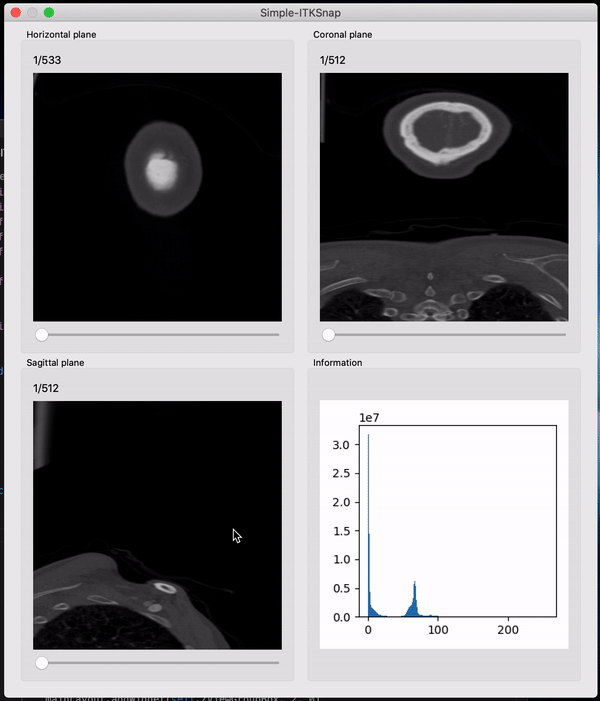

# simpleITK-Snap

It's a Qt-based 3D medical image visualization tool. The code is short thus it's super easy to understand and modify. In short, it is an ITK-Snap in 200 lines!

If you have any bug when using simpleITK-Snap, please put that on the issue.
## Install
First, clone this repo to your local environment:

```bash
git clone https://github.com/JamesQFreeman/simpleITK-Snap.git
```

Then use pip to install the dependency package:

```bash
pip install -r requirements.txt
```

Then you are ready to go!

## Usage
Let's see an example of a brain CT image:

To open an image, simply type:

```bash
python simpleITK-Snap -f YourFile.nii.gz
```




## Dependency
- SimpleITK
- numpy
- opencv-python<4.2
- PyQt5

## DEV NOTE

### FEATURES TO ADD
- Add ```SimpleITKSnap.display(img: ndarray), SimpleITKSnap.show()```
- The lower right widget should be wrote as an extension not a fix format.
- Write some example of extension, like Fourier Transform