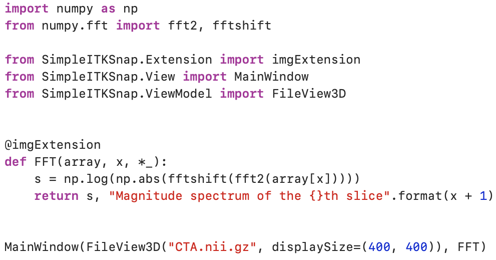

<div align="center">
  
</div>

## Overview
SimpleITKSnap is a 3D-image visualization tool. SimpleITKSnap is developed to bridge the gap between 3D-image process
programming and its visualization. Comparing to the existing method, SimpleITKSnap have these advantage:

</a>  

1. Matplotlib-style display: ```SimpleITKSnap.imshow(yourArray)```. 
You don't need to save your processed result to disk, open ITK-SNAP, find the file and load it again.
2. Extension-based design, meet your visualization demand by writing your own extension. 
The extension development requires minimal code and is super easy to √evelop.


## Install
First, clone this repo to your local environment:

```bash
git clone https://github.com/JamesQFreeman/simpleITK-Snap.git
```

Then use pip to install the dependency package:

```bash
pip install -r requirements.txt
```

Then you are ready to go!

## Usage

### In-place Mode
You can open 3D image in python code.
```python
import SimpleITKSnap as sis
from SimpleITKSnap.Extension import histogram
array = np.arange(0,256*256*256).reshape(256,256,256)
sis.imshow(array, histogram)
```

### Application Mode
Let's see an example of a brain CT image:
To open an image, simply type:
```bash
python simpleITK-Snap -f YourFile.nii.gz
```


## Extension
You can develop your own extension in two ways:
- Matplotlib-style:
```python
@pltExtension
def yourExtension(array3d:ndarray, x:int, y:int, z:int) -> str:
    plt.whateverYouWant()
    return "Extention display test at {}, {}, {}".format(x,y,z)
```

- Array-style:
```python
@imgExtension
def yourExtention(array3d:ndarray, x:int, y:int, z:int) -> Tuple[ndarray,str]:
    processed_2d_image = whateverYouWant()
    return processed_2d_image, "Extention display test at {}, {}, {}".format(x,y,z)
```

## Dependency
- python3
- SimpleITK
- numpy
- opencv-python
- PyQt5


## Coming Soon
#### release 0.1.2
- Test on Windows10, and Linux.
#### release 0.1.3
- Package the project to a ```.wheel```
#### release 0.1.4
- Add jupyter notebook support.

## Developer
SimpleITKSnap is started by JamesQFreeman(wsheng@sjtu.edu.cn).